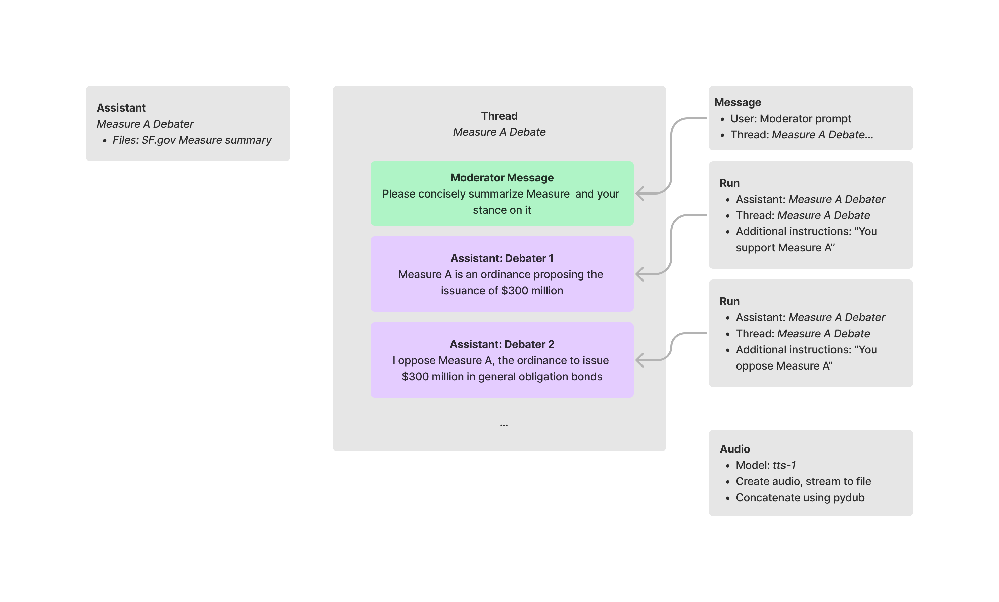

# OpenAI Debaters

Are you trying to be an informed voter? Do you hate listening to talking heads attack each other and never talk about the actual issues? Do you just want to know what the measures are and then hear intelligent debate around them? 

Well this repo is for you! We feed the [official city election guide](https://voterguide.sfelections.org/local-ballot-measures) from San Francisco for the upcoming 2024 city ballot measures to the [OpenAI Assistants API](https://platform.openai.com/docs/api-reference/assistants), then create an informed debate on each measure. We then turn the text into audio using [OpenAI's TTS model](https://platform.openai.com/docs/models/tts). 

The result? High quality, informed debate on all 7 measures up for election this year.
Each debater will open and close their debate, and the number of rounds in between is configurable.  Worried about me trying to sway you to either side? This repo open sources the instructions given to each agent, so you can examine exactly what they are asked to do. 

Enjoy!

## Results
| Measure      | Text | Audio |
| ----------- | ----------- | ----------- |
|Measure A: Affordable Housing Bonds | [text](docs/debate_a.txt) | [audio](docs/issue_a.mp3) |
|Measure B: Police Office Staffing Levels | [text](docs/debate_b.txt)| [audio](docs/issue_b.mp3) |
|Measure C: Real Estate Transfer Tax Exemption | [text](docs/debate_c.txt)| [audio](docs/issue_c.mp3) |
|Measure D: Changes to Local Ethics Laws | [text](docs/debate_d.txt)| [audio](docs/issue_d.mp3) |
|Measure E: Police Department Policies and Procedures | [text](docs/debate_e.txt)| [audio](docs/issue_e.mp3) |
Measure F: Illegal Substance Dependence Screening and Treatment for Recipients of City Public Assistance | [text](docs/debate_f.txt)| [audio](docs/issue_f.mp3) |
|Measure G: Offering Algebra 1 to Eighth Graders | [text](docs/debate_g.txt)|  [audio](docs/issue_g.mp3) |

## Installation
1. Generate an OpenAI key: https://platform.openai.com/api-keys. 
2. Export it to your local environment using `export OPENAI_API_KEY=<your key here>`
3. Install necessary libraries with `pip install -r requirements.txt`
4. Launch the included jupyter notebook and run the cells. 
5. Output will be place in `<location of repo>/outputs`

- Each Issue gets a custom assistant, which has access to a downloaded copy of the Measure summary from sf.gov.
- Each Debate is a persistent thread, and the user acts as a moderator to put messages in the thread
- The AI Assistant debates itself, and a run is created each time, pointing to both the past history of messages and the assistant that should come up with a response. 

## Notes
- At first I created two agents to debate each other, but then realized I could include [Additional instructions](https://platform.openai.com/docs/api-reference/runs/createRun) in a run that would tell the assistant to flip sides. 
- The assistant is initially created with explicit instructions on how a debate is structured. After some prompt engineering, I found that it was necessary to explicitly ask it to respond to the other debater, to preface its answers with the debater title (for each of telling who's who), and to ask it to introduce novel arguments so it wasn't just repeating what was in the measure summary. 

## So, does it work? 
The audio generation and the text are coherent. The agents respond to each other, and in the case of most measures, come up with novel arguments. 
   
For example, in Measure A, a proponent of the measure brings up the economic benefits of creating this housing. An opponent brings up that a large capital expenditure now puts the city in a less flexible position should economic conditions change. 
  
Downsides - the agents are still quite verbose, and one could make the argument that you could still get higher information density by just reading the ballot measure. But, the debaters do bring new insight and considerations into the mix. Plus, it's nice to be able to listen to a summary of the issues while commuting or washing dishers, rather than picking up the paper to read :)
